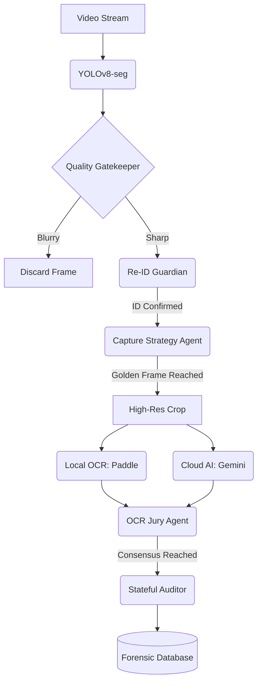

# ALPR Pro: Master Technical Documentation (v1.0 - v3.0 Agentic Integrity)

## 🚀 1. Project Vision & Overview
ALPR Pro is a professional-grade vehicle forensic and traffic monitoring system. It leverages a hybrid intelligence model, combining real-time edge computer vision (YOLOv8 + ByteTrack) with high-fidelity semantic reasoning (Google Gemini 1.5 Flash).

### The "Agentic Integrity" Philosophy (v3.0)
Unlike traditional systems that rely on a single detection event, ALPR Pro v3.0 operates on a **Voter-Consensus** model. Every forensic record is the result of multiple agents auditing each other—ensuring that hallucinations are eliminated and data accuracy is maximized.

---

## 🏗️ 2. The v3.0 "Voter-Consensus" Architecture

### The Forensic Agent Pipeline
1.  **Detector Agent (YOLOv8-seg)**: Performs the initial vehicle and plate segmentation.
2.  **Quality Gatekeeper (NEW)**: Discards blurry or poorly lit frames using Laplacian Variance analysis.
3.  **Re-ID Guardian (NEW)**: Prevents "Identity Swaps" by comparing visual embeddings (feature vectors) of vehicles.
4.  **Capture Strategy Agent (NEW)**: "Snipes" the perfect "Golden Frame" based on bounding box size and viewing angle.
5.  **OCR Jury Agent (NEW)**: Arbitrates between Local OCR (PaddleOCR) and Cloud AI (Gemini) using weighted scoring.
6.  **Stateful Auditor**: Aggregates all forensic evidence into a single, deduplicated Master Record.

---

## 📁 3. Project Directory Map
```text
/
├── app/
│   ├── api/                # Route Controllers
│   │   ├── auth.py         # JWT Security & Session Management
│   │   ├── videos.py       # Stream, Upload, and Forensic Reports
│   │   ├── detections.py   # Advanced Paginated Search
│   │   └── v2_api.py       # Agent Telemetry & Remote Configuration
│   ├── core/               # System Settings & Security
│   ├── models/             # SQLAlchemy Database Entities (v3.0 Schema)
│   ├── services/           # Core Logic Layer
│   │   ├── ai_service.py   # AI Orchestrator (YOLO, OCR, Gemini, Jury)
│   │   └── video_service.py# The Forensic Execution Loop
│   └── worker.py           # Distributed Task Workers (Celery/Redis)
├── frontend/               # Glassmorphic User Interface
│   ├── js/app.js           # Modular Frontend Logic
│   └── dashboard.html      # Main Application UI
├── storage/                # Collages, Results, and Audit Logs
├── weights/                # Pre-trained CV Models (.pt)
└── main.py                 # Application Entry Point
```

---

## 🛠️ 4. Comprehensive Tech Stack

### **Backend & Storage**
- **Framework**: FastAPI (Asynchronous, High-Performance)
- **Database**: SQLite / PostgreSQL (SQLAlchemy ORM)
- **Task Management**: Celery + Redis (Asynchronous Processing)
- **Security**: JWT OAuth2, BCrypt hashing

### **AI & Computer Vision**
- **Inference**: Ultralytics YOLOv8-seg, ByteTrack
- **OCR Engine**: PaddleOCR (Edge) + Google Gemini 1.5 Flash (Cloud)
- **Pre-processing**: OpenCV (Laplacian Sharpness, Histogram Equalization)

---

## 🏗️ 5. Exhaustive Database Schema (v3.0)

### **VehicleDetection (Forensic Record)**
| Field | Type | Description |
| :--- | :--- | :--- |
| `plate_number` | String | Consolidated license plate ID |
| `track_id` | Integer | Persistent tracking ID |
| `vehicle_type` | String | CAR, MOTORCYCLE, BUS, TRUCK, etc. |
| `helmet_status` | String | HELMET, NO_HELMET, N/A |
| `passenger_count` | Integer | Confirmed occupant count |
| `visual_embedding` | Text/JSON | **(v3.0)** Feature vector for Re-ID logic |
| `blur_score` | Float | **(v3.0)** Laplacian variance of the crop |
| `ocr_source` | Enum | LOCAL, CLOUD, or CONSENSUS |
| `raw_inference_log`| JSON | **(v3.0)** Full agentic argument history |

### **DetectionBatch (Forensic Collage)**
| Field | Type | Description |
| :--- | :--- | :--- |
| `collage_path` | String | Path to the high-res 3x3 grid or dynamic strip |
| `raw_json` | String | Full response from the Gemini Vision Agent |

---

## 📡 6. Complete API Reference

### **Management Endpoints**
- `POST /api/auth/login`: Authentication and token grant.
- `POST /api/videos/upload`: Submit a new video for forensic analysis.
- `GET /api/videos/{id}/report`: Download the final verified JSON report.

### **In-Depth Detections**
- `GET /api/detections/`: Search for vehicles with filters (plate, confidence, duration).
- `GET /api/v2/agent-status`: Real-time telemetry for all processing agents.
- `POST /api/v2/agent-settings`: Remote tuning of AI thresholds.

---

## 📈 7. The Agentic Flow Diagram (v3.0)



---
*Document Version: 3.0 (Master Project Record)*
